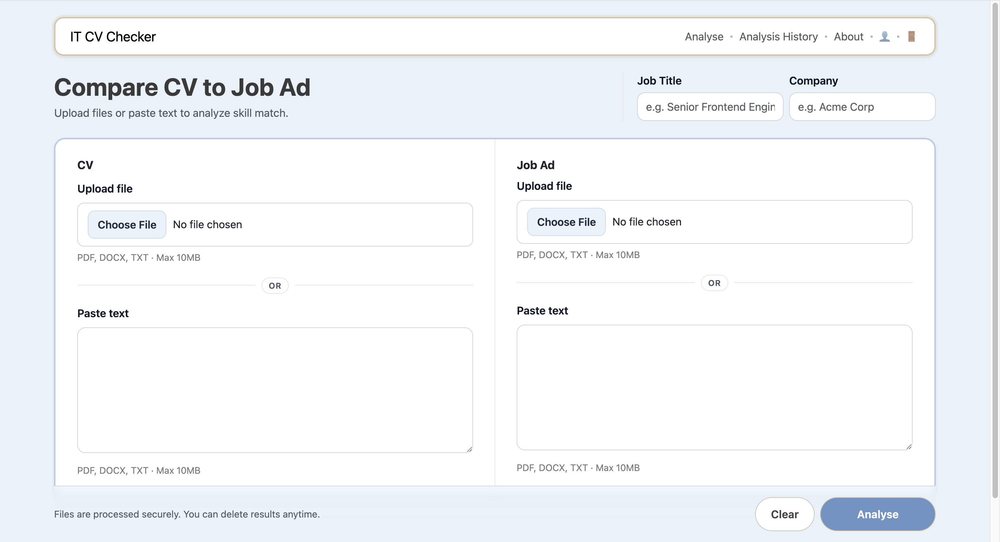
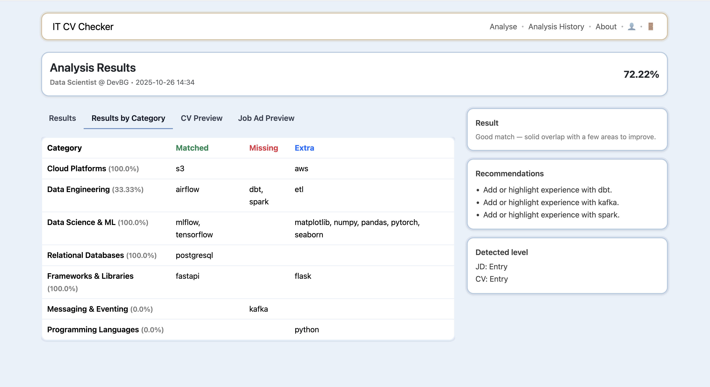
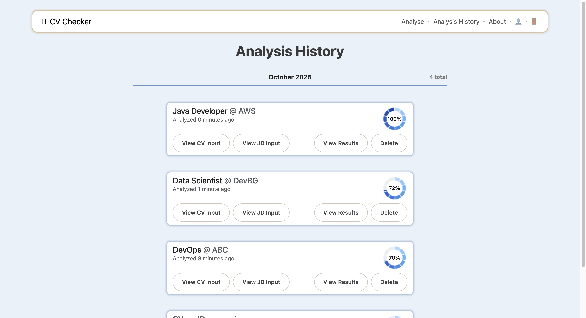

# IT CV-Checker — Darina Milanova

**Live Demo:** https://it-cvchecker.onrender.com  
**Demo Credentials:** demo / DemoPass123!

A Django web app focused on **IT roles**. It compares a **software/IT CV** to a **Job Description**, calculates a **match %**, and highlights **matched / missing / extra** skills by category with quick recommendations.  
> **Scope:** Currently supports **IT / tech CVs only** (programming languages, frameworks, databases, cloud, tools).

---

## Features
- Upload CV & JD (PDF, DOC, DOCX, RTF, or paste text)
- Match score with progress bar + color badges
- Category breakdown: matched / missing / extra
- Short, actionable recommendations
- “My Analyses” page (view / download / delete)
- **IT-focused taxonomy** (languages, frameworks, DBs, cloud, tooling)

---

## Stack
| Area | Technologies |
|------|--------------|
| Backend | Django 5 |
| NLP | Regex + dictionaries |
| Parsing | `pdfminer.six`, `python-docx`, `striprtf` |
| Database | SQLite by default (PostgreSQL optional) |
| UI | Bootstrap 5 + custom CSS |

---

## Project Structure
```
it-cv-checker/
├── manage.py
├── requirements.txt
├── requirements-postgres.txt        # optional: adds psycopg
├── .env.example                     # sample env keys
│
├── config/                          # project settings & taxonomy
│   ├── __init__.py
│   ├── settings.py
│   ├── urls.py
│   ├── wsgi.py
│   ├── asgi.py
│   ├── skills_taxonomy.json         # IT-focused categories & aliases
│   └── level_signals.json           # junior/mid/senior signal patterns
│
├── app/                             # main Django app
│   ├── __init__.py
│   ├── admin.py
│   ├── apps.py
│   ├── forms.py
│   ├── models.py
│   ├── urls.py
│   ├── views.py
│   └── nlp_utils.py                 # regex/alias-based extraction
│
├── templates/
│   ├── base.html
│   ├── upload.html
│   ├── analysis_detail.html
│   └── profile.html
│
├── static/
│   ├── css/
│   ├── js/
│   └── images/
│
└── docs/
    └── img/                         # screenshots for README
```

---

## Screenshots
- 
- 
- 

---

## Quickstart
```bash
python -m venv .venv
source .venv/bin/activate      # Windows: .venv\Scripts\Activate.ps1
pip install -r requirements.txt
python manage.py migrate
python manage.py runserver
```
Open http://127.0.0.1:8000

---

## 👩🏻‍💻 Author

**Darina Milanova**  

Built with ❤️ using **Django & Bootstrap**

📧 darinakmilanova@gmail.com  
🔗 https://www.linkedin.com/in/darina-milanova-a64240241/  
💻 https://github.com/DarinaMilanova
